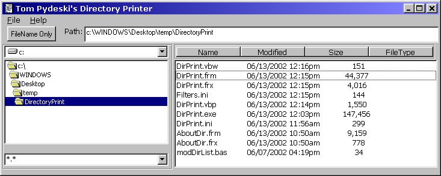



## Print Directory

### Description

My friend Carlos was after me to write something to print and save directories

that he could then use to make labels for cds full of mp3s.

i looked at what was on psc and found one but modified it greatly.

sorry, i dont know who the original author was, but this is not even close to what he had.

instead of just listing the files, the list contains the size and date of the file

this was accomplished using tabs to separate the data within each list item.

the tabstops then had to be set for the longest entry in each column

i then added the option buttons to sort by filename; size; extension; or date.

Additionally, the 10 last directories are stored as well as any additional filters

for the file list. An option for displaying the file names only will use a different

unsorted listbox (you cant change the sort property at run time) to contain only the

file names in the order they appear in the directory (un-sorted)

If a right click menuitem is added to explorer, the program can be launched to print the

directory. try putting a directory name in the command line option (goto project; properties;

and the make tab and put something like C:\WINDOWS\CONFIG\ in the command line arguments

The original had drag and drop, so i left that in.
 
### More Info
 
none, unless a commandline argument is passed, which would then be a directory path.

see purpose

listing of the directory selected

             |
---                |---
**Submitted On**   |2002-06-14 10:35:00
**By**             |[Tom Pydeski](https://github.com/Planet-Source-Code/PSCIndex/blob/master/ByAuthor/tom-pydeski.md)
**Level**          |Intermediate
**User Rating**    |5.0 (25 globes from 5 users)
**Compatibility**  |VB 6\.0
**Category**       |[Windows System Services](https://github.com/Planet-Source-Code/PSCIndex/blob/master/ByCategory/windows-system-services__1-35.md)
**World**          |[Visual Basic](https://github.com/Planet-Source-Code/PSCIndex/blob/master/ByWorld/visual-basic.md)
**Archive File**   |[Print\_Dire944466142002\.zip](https://github.com/Planet-Source-Code/tom-pydeski-print-directory__1-35798/archive/master.zip)

### API Declarations

see code

